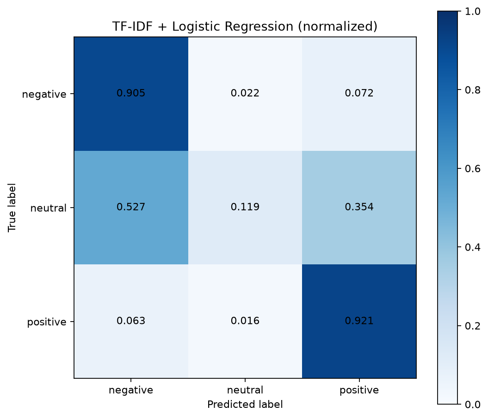

# Amazon Fashion 评论情感分类基线模型报告

## 一、任务说明

数据来自数仓 production-v1 的 99,703 条 Amazon Fashion 评论，目标为 negative、neutral、positive 三分类。`rating_label` 是由星级映射得到的弱监督训练目标，不是模型预测；模型特征仅使用 `review_text_clean`，未使用评分、商品或类目字段。

## 二、数据划分

使用 random_state=42 按弱标签分层划分，训练/验证/测试分别为 79762/9970/9971 条。

| 数据集 | negative | neutral | positive |
|---|---:|---:|---:|
| 训练 | 12512 | 8730 | 58520 |
| 验证 | 1564 | 1091 | 7315 |
| 测试 | 1564 | 1092 | 7315 |

## 三、模型方法

采用 unigram + bigram 的 TF-IDF 文本特征和带 `class_weight=balanced` 的 Logistic Regression。保留否定词，不使用英文停用词。由于类别不均衡，参数选择以各类别同权的 macro-F1 为主。

## 四、参数选择

| C | 验证 accuracy | 验证 macro-F1 | 验证 weighted-F1 |
|---:|---:|---:|---:|
| 0.5 | 0.780040 | 0.658552 | 0.802843 |
| 1.0 | 0.761785 | 0.654681 | 0.794140 |
| 2.0 | 0.741123 | 0.599131 | 0.771307 |

按验证 macro-F1、再按 accuracy 决胜，选择 C=0.5。

## 五、测试集结果

留出测试集 accuracy=0.830408，macro-F1=0.606527，weighted-F1=0.810371。测试集只在选定 C 并用训练集与验证集合并重训后评估一次。

| 类别 | precision | recall | F1 | support |
|---|---:|---:|---:|---:|
| negative | 0.576782 | 0.905371 | 0.704653 | 1564 |
| neutral | 0.460993 | 0.119048 | 0.189229 | 1092 |
| positive | 0.930882 | 0.920574 | 0.925699 | 7315 |

归一化混淆矩阵：

## 六、5 折 OOF 官方预测与全量模型

数仓使用 5 折 Stratified OOF 预测（shuffle=True，random_state=42）。每条评论只由未训练过该记录的折模型预测，并按原始输入顺序回填。共生成 99703 条 OOF 预测，唯一键 99703 个，覆盖率 100.00%。预测标签分布为 {"negative": 15899, "neutral": 18943, "positive": 64861}，pred_score 范围为 0.336122–0.999982，输出 SHA-256 为 `6f864870573275f38a610b3d9c6b0bed3250e208061d81d2fc45edfc20f40f95`。

在留出测试评估和 OOF 预测全部完成之后，另用全部 99703 条弱标注记录训练最终模型。该工件仅用于未来未见评论推理，没有参与本批官方 OOF 数仓预测。

## 七、数仓交付格式

预测 JSONL 固定包含：`review_key`、`pred_label`、`pred_score`、`negative_score`、`neutral_score`、`positive_score`、`model_version`、`inferred_at`。

## 八、限制

- 标签来自星级映射，属于弱监督标签，并非人工真值；
- 本模型是经典机器学习基线，不是 Transformer 或大语言模型；
- 三类分布不均衡，少数类结果需结合逐类指标理解；
- 本次共有 10 个拟合阶段在 max_iter=1000 达到迭代上限；相关 ConvergenceWarning 已完整记录在 metrics JSON，结果可作为基线，但后续应继续调优收敛性；
- 官方数仓预测使用 5 折 OOF，每条记录均由未训练过该记录的折模型预测；
- 最终全量模型仅供未来未见评论推理，没有用于生成本批官方数仓预测；
- 本报告测试指标只来自未参与参数选择的独立留出测试集；
- 当前未训练 Transformer 模型，也未执行数仓预测导入。

## 九、结果

训练、留出测试评估、5 折 OOF 预测、预测契约校验和未来推理全量模型工件均已通过。

NLP BASELINE TRAINING RESULT: PASS

HELD-OUT TEST EVALUATION RESULT: PASS

OOF PREDICTION GENERATION RESULT: PASS

PREDICTION CONTRACT VALIDATION RESULT: PASS

FULL MODEL ARTIFACT RESULT: PASS
