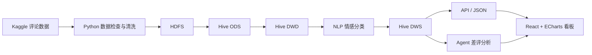

# 电商用户评论情感分析项目工作流程

> **项目方向：** 大数据方向  
> **官方选题：** 基于公开数据集的电商用户评论情感分析  
> **建议项目名称：** 基于 HDFS、Hive 与 NLP 的电商用户评论情感分析及运营建议系统  
> **小组人数：** 4 人  
> **数据来源：** Kaggle 公开电商评论数据集（ZIP 已下载）

---

## 1. 项目目标

针对海量电商用户评论难以人工逐条阅读的问题，构建一套完整的大数据评论分析系统，实现：

- 评论数据的检查、清洗和标准化；
- 使用 HDFS 保存大规模评论数据；
- 使用 Hive 完成 ODS、DWD、DWS 数仓分层；
- 使用 NLP 模型完成正面、中性、负面三分类；
- 分析情感趋势、差评商品和主要差评原因；
- 通过可视化看板展示分析结果；
- 可选使用 Agent 自动生成差评总结和运营改进建议。

---

## 2. 项目总体架构

```text
Kaggle 评论数据 ZIP
        ↓
数据解压与字段检查
        ↓
Python 数据清洗与标签生成
        ↓
HDFS 分布式存储
        ↓
Hive ODS 原始数据层
        ↓
Hive DWD 清洗明细层
        ↓
NLP 情感分类模型
        ↓
Hive DWS 汇总分析层
        ↓
API / JSON 数据接口
        ↓
React + ECharts 可视化看板
        ↓
可选 Agent 差评总结与运营建议
```

### Mermaid 架构图



---

## 3. 第一阶段：数据集检查

### 主要任务

1. 解压 Kaggle ZIP；
2. 查看文件格式：CSV、JSON、JSONL 或 Parquet；
3. 检查数据行数、文件大小和编码；
4. 检查是否包含表头；
5. 检查字段名称和字段类型；
6. 检查评分、评论文本、商品 ID、用户 ID 和时间字段；
7. 检查缺失值、重复值和异常评分；
8. 确认数据集许可和原始来源。

### 必要字段

| 业务内容 | 可能字段名 | 是否必需 |
|---|---|---|
| 评论文本 | `Text`、`review_text`、`content` | 必需 |
| 星级评分 | `Score`、`Rating`、`stars` | 必需 |
| 商品 ID | `ProductId`、`asin`、`product_id` | 建议 |
| 用户 ID | `UserId`、`reviewerID`、`user_id` | 建议 |
| 评论时间 | `Time`、`timestamp`、`reviewTime` | 建议 |
| 评论标题 | `Summary`、`title` | 可选 |
| 商品品类 | `Category`、`category` | 可选 |
| 是否真实购买 | `verified_purchase` | 可选 |

### 第一阶段产出

- `docs/DATA_DICTIONARY.md`
- 数据集检查报告；
- 字段说明表；
- 数据规模说明；
- 100 条样例数据；
- 数据质量初步统计。

---

## 4. 第二阶段：数据清洗与标签生成

### 清洗规则

- 删除评论文本为空的记录；
- 删除完全重复的评论；
- 处理 HTML 标签和异常空格；
- 统一时间格式；
- 检查评分是否在 1～5 分范围内；
- 处理过短或无实际意义的评论；
- 保留原始文本，同时生成清洗文本；
- 不直接覆盖原始数据。

### 情感标签规则

```text
1～2 星 → Negative（负面）
3 星   → Neutral（中性）
4～5 星 → Positive（正面）
```

### 建议输出字段

| 字段 | 说明 |
|---|---|
| `review_id` | 评论唯一标识 |
| `user_id` | 用户标识 |
| `product_id` | 商品标识 |
| `rating` | 原始评分 |
| `review_title` | 评论标题 |
| `review_text` | 原始评论 |
| `clean_text` | 清洗后文本 |
| `review_time` | 评论时间 |
| `category` | 商品品类 |
| `rating_label` | 根据评分生成的标签 |
| `text_length` | 评论文本长度 |
| `is_valid` | 是否为有效评论 |

### 第二阶段产出

- Python 清洗脚本；
- 清洗后样例数据；
- 数据质量统计；
- 标签数量分布图；
- 清洗前后数据对比。

---

## 5. 第三阶段：HDFS 与 Hive 数仓分层

## 5.1 HDFS

建议 HDFS 目录：

```text
/data/ecommerce_review/raw/
/data/ecommerce_review/clean/
/data/ecommerce_review/model_output/
```

数据上传后需要验证：

- 文件是否存在；
- 文件大小是否一致；
- 数据行数是否合理；
- HDFS 路径是否正确。

## 5.2 ODS 层

建议表名：

```text
ods_review
```

作用：

- 保存原始评论数据；
- 尽量少做业务转换；
- 保证数据可追溯。

建议按日期分区：

```text
dt=YYYY-MM-DD
```

## 5.3 DWD 层

建议表名：

```text
dwd_review_clean
```

主要内容：

- 清洗后的评论；
- 标准时间字段；
- 情感训练标签；
- 文本长度；
- 有效性标记；
- 后续模型预测结果。

## 5.4 DWS 层

建议创建以下汇总表：

### 每日情感汇总

```text
dws_sentiment_daily
```

指标：

- 评论总数；
- 正面评论数；
- 中性评论数；
- 负面评论数；
- 好评率；
- 差评率；
- 平均评分。

### 商品情感汇总

```text
dws_product_sentiment
```

指标：

- 商品评论数；
- 平均评分；
- 正面评论数；
- 负面评论数；
- 商品差评率；
- 模型平均置信度。

### 品类情感汇总

```text
dws_category_sentiment
```

指标：

- 品类评论数；
- 好评率；
- 中评率；
- 差评率；
- 平均评分。

### 差评原因汇总

```text
dws_negative_reason
```

指标：

- 差评原因；
- 原因出现次数；
- 原因占比；
- 相关商品；
- 代表性评论。

---

## 6. 第四阶段：NLP 情感分类

### 基线模型

```text
TF-IDF + Logistic Regression
```

优点：

- 训练速度快；
- CPU 可以运行；
- 容易解释；
- 适合作为基线。

### 改进模型

```text
TF-IDF（unigram + bigram）
+ Linear SVM
+ class_weight
```

### 可选加分模型

```text
DistilBERT 或其他轻量级 Transformer
```

时间紧时，Transformer 作为加分项，不作为唯一方案。

### 数据划分

```text
训练集：80%
测试集：20%
使用 Stratified Split
固定 random_state
```

### 评估指标

- Accuracy；
- Precision；
- Recall；
- Macro-F1；
- Weighted-F1；
- Confusion Matrix；
- 训练时间；
- 单条预测延迟；
- Negative Recall。

### 第四阶段产出

- 基线模型；
- 改进模型；
- 模型评估表；
- 混淆矩阵；
- 模型对比图；
- 模型预测结果文件。

---

## 7. 第五阶段：差评原因分析

### 推荐方法

1. 关键词统计；
2. TF-IDF 高频词；
3. 规则词典分类；
4. 文本聚类；
5. 可选大模型总结。

### 初步差评原因类别

- 商品质量问题；
- 包装破损；
- 物流延迟；
- 尺码不符；
- 颜色不符；
- 商品与描述不符；
- 使用困难；
- 气味问题；
- 使用寿命短；
- 客服服务问题。

所有差评原因必须有数据证据，不能由 Agent 随机生成。

---

## 8. 第六阶段：可视化看板

### KPI 指标

- 评论总数；
- 正面评论数；
- 中性评论数；
- 负面评论数；
- 好评率；
- 差评率；
- 平均评分；
- 高风险商品数量。

### 图表设计

1. 情感分布环形图；
2. 每日情感趋势；
3. 品类情感对比；
4. 商品差评率 TOP10；
5. 差评原因排名；
6. 星级与预测情感对比；
7. 评论长度分布；
8. 模型混淆矩阵；
9. 模型性能对比；
10. 最近高风险评论。

### 筛选条件

- 日期；
- 商品；
- 品类；
- 星级；
- 情感类别；
- 是否真实购买；
- 差评原因。

### 技术建议

```text
React + Vite + ECharts
```

数据读取方式：

```text
Hive DWS
→ Python 导出 JSON / MySQL
→ API
→ Dashboard
```

浏览器不要直接连接 Hive。

---

## 9. 第七阶段：Agent 加分模块

### Agent 工具一

```text
get_sentiment_summary()
```

用于查询：

- 评论数量；
- 情感分布；
- 差评率；
- 时间趋势。

### Agent 工具二

```text
get_negative_reasons()
```

用于查询：

- 差评原因排名；
- 出现次数；
- 代表性评论；
- 受影响商品。

### Agent 输出

1. 当前问题概述；
2. 主要差评原因；
3. 数据证据；
4. 改进建议；
5. 处理优先级；
6. 风险预警。

建议使用 Qwen 或模板生成作为备用，避免没有 API 时无法演示。

---

## 10. 四人分工建议

| 成员 | 主要职责 | 具体任务 | 最终产出 |
|---|---|---|---|
| 成员 1 | 数据工程 | 数据检查、清洗、样例、HDFS 上传 | 清洗脚本、数据字典、HDFS 数据 |
| 成员 2 | Hive 数仓 | ODS、DWD、DWS、SQL 验证 | Hive SQL、分层表、汇总结果 |
| 成员 3 | NLP 模型 | 标签、基线模型、改进模型、评估 | 模型、实验表、混淆矩阵 |
| 成员 4 | 看板与集成 | API/JSON、React、ECharts、Agent、PPT | Dashboard、Agent、演示和答辩 |

### 协作要求

- 每个人使用独立 Git 分支；
- 每天同步一次进度；
- 统一字段名和数据格式；
- 模型输出字段必须提前确定；
- DWS 表结构与看板指标必须保持一致；
- 每个成员保留运行截图和实验记录。

---

## 11. Git 分支建议

```text
main                  最终稳定版本
develop               集成测试版本
feature/data           数据清洗与 HDFS
feature/warehouse      Hive ODS/DWD/DWS
feature/nlp            NLP 模型
feature/dashboard      前端看板与 Agent
```

提交信息示例：

```text
feat: add review data inspection
feat: create Hive ODS and DWD tables
feat: train sentiment baseline model
feat: build sentiment dashboard
fix: correct sentiment label mapping
docs: update project workflow
```

---

## 12. 建议项目目录

```text
ecommerce_review_sentiment/
├── data/
│   ├── raw/                 # 完整原始数据，不上传 GitHub
│   ├── sample/              # 小样例
│   ├── processed/           # 清洗结果，不上传大文件
│   └── model_output/
├── dashboard/
├── docs/
│   ├── DATA_DICTIONARY.md
│   ├── METRICS.md
│   ├── PROJECT_WORKFLOW.md
│   └── SCREENSHOT_GUIDE.md
├── models/
├── output/
├── scripts/
├── sql/
├── src/
│   ├── data/
│   ├── model/
│   ├── api/
│   └── agent/
├── .env.example
├── .gitignore
├── README.md
└── requirements.txt
```

---

## 13. 最小可行版本（MVP）

必须完成：

- 数据集检查；
- 数据清洗；
- 评分转三分类标签；
- HDFS 存储；
- Hive ODS/DWD/DWS；
- 基线模型；
- 改进模型；
- 模型评估；
- 情感分析看板；
- 商品和品类差评分析。

---

## 14. 加分项

- Agent 自动总结差评原因；
- 自动生成运营建议；
- Transformer 模型对比；
- 高风险商品自动预警；
- 差评主题聚类；
- 商品详情分析页面；
- 数据质量监控。

---

## 15. 暂时不优先做

- Kafka；
- Flink 实时流处理；
- HBase；
- 复杂 RAG；
- 多模态分析；
- 实时网络爬虫；
- 大模型微调；
- 多语言统一模型。

先完成稳定的离线大数据处理闭环，再考虑扩展。

---

## 16. 推荐执行顺序

```text
第 1 步：检查 Kaggle ZIP 和字段
第 2 步：生成 100 条样例
第 3 步：完成清洗和三分类标签
第 4 步：上传 HDFS
第 5 步：创建 Hive ODS
第 6 步：构建 Hive DWD
第 7 步：训练基线与改进模型
第 8 步：将预测结果写回 DWD 或结果表
第 9 步：构建 DWS 汇总表
第 10 步：开发 Dashboard
第 11 步：接入 Agent 加分模块
第 12 步：测试、截图、报告和答辩
```

---

## 17. 三天快速计划

### 第一天：数据与基线

- 检查 ZIP；
- 确定字段；
- 创建数据字典；
- 清洗评论；
- 生成标签；
- 训练 TF-IDF + Logistic Regression；
- 输出第一版模型结果。

### 第二天：数仓与看板

- 上传 HDFS；
- 创建 ODS、DWD、DWS；
- 生成商品、品类和每日情感汇总；
- 开发看板；
- 接入筛选和商品详情。

### 第三天：改进与答辩

- 训练 SVM 改进模型；
- 完成模型对比；
- 完成差评原因分析；
- 增加 Agent 建议；
- 完成截图、PPT 和演示稿；
- 进行小组答辩演练。

---

## 18. 答辩主线

```text
业务痛点
→ 数据来源
→ 大数据处理架构
→ HDFS 与 Hive 数仓分层
→ NLP 情感分类
→ 模型评估与对比
→ 差评原因分析
→ 看板展示
→ Agent 运营建议
→ 团队分工与项目总结
```

### 一句话项目介绍

> 本项目面向海量电商用户评论，使用 HDFS 和 Hive 构建评论数据处理与数仓分析链路，利用 NLP 模型完成正面、中性和负面情感分类，并通过可视化看板展示情感趋势、差评商品和问题原因，最后由 Agent 基于真实分析结果生成运营改进建议。
